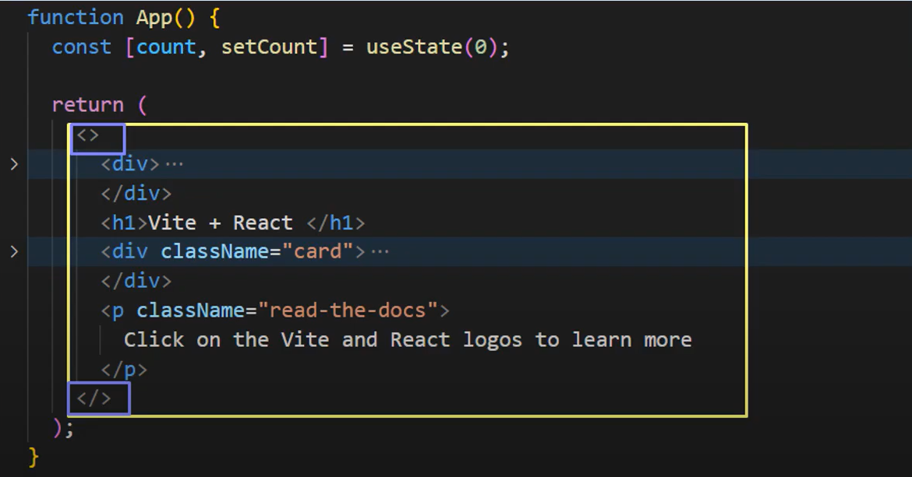
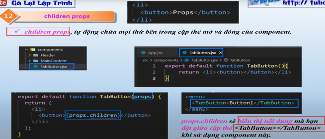
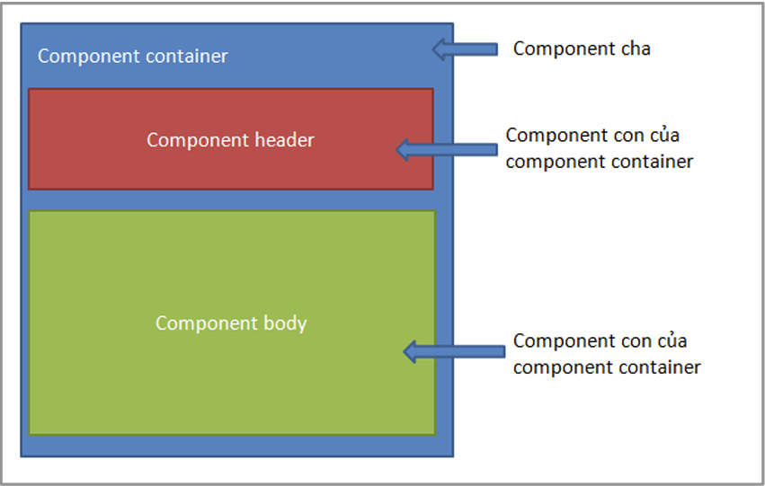

# Component
💡 Component thật ra chỉ là 1 hàm js, nhưng nó tuân theo quy tắc  
- Tên function **viết hoa** chữ cái đầu
- Phải return về giá trị có thể **hiển thị được**, và là **1 phần tử duy nhất**


## Child component
💡 Dùng để hiện thị nội dung mà đặt giữa cặp thẻ Component  



#### Kiểu component
React có 2 kiểu viết component:  
- Functional component  
- Class component  

#### Functional component
- Là một function Javascript / ES6 function 
- Phải trả về 1 React element. 
- Nhận props làm tham số nếu cần. 
```jsx
function exampleFunctionalComponent() { 
    return ( <h1>Tôi là một functional component!</h1> ); 
};
```
#### Class component
- Là một class kế thừa từ React.Component 
- Có thể nhận props (trong hàm khởi tạo) nếu cần. 
- Phải có hàm render() và trong đó trả về 1 React element hoặc NULL.
```jsx
class Welcome extends React.Component { 
    render() { 
        return <h1>Hello, {this.props.name}</h1>; 
    } 
} 
```
