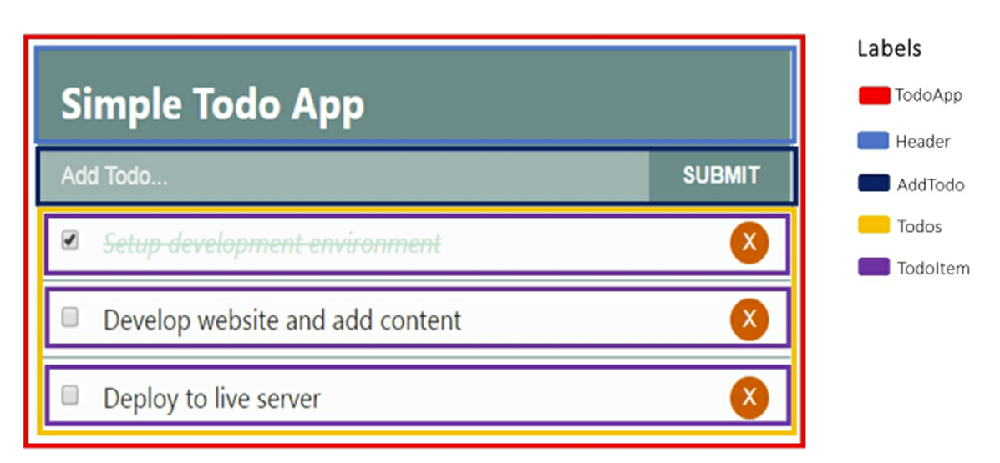

- Để truyền dữ liệu từ component cha xuống component con thì truyền qua **Props**. 
- Còn truyền dữ liệu từ component con lên component cha, sử dụng **event** là cách 
phổ biến nhất.


```jsx
UI Click (TodoItem checkbox)
        ↓ gọi callback
TodoItem.onChange()
        ↓ props.handleChange(id)
Todos.handleChange(id) (props)
        ↓
TodoApp.handleCheckboxChange(id)
        ↓ setState()
TodoApp.state.todos cập nhật
        ↓ re-render
Todos + TodoItem render lại
        ↓ UI checkbox update
```
```jsx
class TodoApp extends React.Component { // Cha giữ state
  state = {
    todos: [
      { id: 1, title: "Learn React", completed: false },
      { id: 2, title: "Build Todo App", completed: true }
    ]
  };

  handleCheckboxChange = id => {
    this.setState({
      todos: this.state.todos.map(todo =>
        todo.id === id ? { ...todo, completed: !todo.completed } : todo
      )
    });
  };

  render() {
    return (
      <div>
        <h1>Todo App</h1>
        <Todos
          todos={this.state.todos}
          handleChange={this.handleCheckboxChange}
        />
      </div>
    );
  }
}

function Todos(props) { // Con chỉ nhận props để hiển thị
  return (
    <ul>
      {props.todos.map(todo => (
        <TodoItem
          key={todo.id}
          todo={todo}
          handleChange={props.handleChange}
        />
      ))}
    </ul>
  );
}

function TodoItem(props) {
  return (
    <li>
      <input
        type="checkbox"
        checked={props.todo.completed}
        onChange={() => props.handleChange(props.todo.id)}
      />
      {props.todo.title}
    </li>
  );
}
```