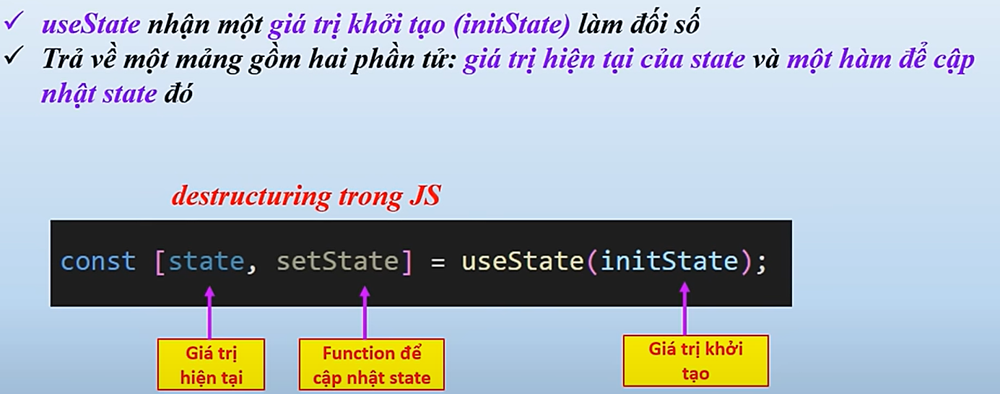

# State
- Để có thể lưu giá trị có thể từ người dùng nhập, hoặc giá trị khởi 
tạo mặc định... thì bạn sẽ phải cần đến state.  
- State là một đối tượng lưu trữ dữ liệu nội bộ của một component và có thể thay đổi
theo thời gian. 
→ Khi state của 1 component thay đổi, React sẽ tự động cập nhập lại giao diện để
phản ánh những thay đổi đó.    

<br><br>

💡 Để component truy xuất vào state tối ưu nhất, bạn cần **định nghĩa state** trong 
component cha **gần** với các component đó nhất.  

#### - Để sử dụng ta sử dụng **useState**
- Tất cả thành phần bắt đầu bằng use... được gọi là **react Hook**  
- Hook bản chất là các hàm tính năng được React thiết kế sẵn  

```js
import {useState} from "react";
```
    
#### ⚠ Khi sử dụng bắt buộc phải gọi tại cấp cao nhất của hàm thành phần
```jsx
function App() {
  useState(); // Đúng

  function handleClick(ten) {
    useState(); //Sai: không gọi trong hàm
  }

  let isOnline = true;
  if(isOnline) 
  { 
    useState(); // Sai: không gọi trong if/else 
  }

  return (
    <>
    useState(); //Sai: không gọi trong hàm jsx
    <menu></menu>
    <li></li>
    </>
  )
}
```  
<br><br>


  

💡Sau khi định nghĩa state, chúng ta truy xuất dữ liệu của state trong hàm render() thông 
qua từ khóa `this`.
**Ví dụ** 
```jsx
render() { 
        return ( 
            <div> 
                <Header /> 
                <ul> //todo là mảng nên phải duyệt
                    {this.state.todos.map(todo => ( 
                        <li key={todo.id}>{todo.title}</li> 
                    ))} 
                </ul> 
            </div> 
        ); 
}
```
#### Dùng useState để hiển thị dữ liệu thực


